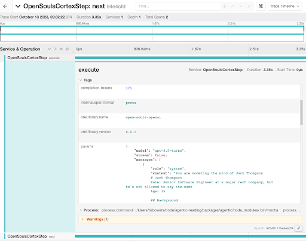

# Announcing socialagi/next

We've just implemented some major improvements to SocialAGI. These updates allow better control over your Open Soul’s cognition, and a much improved developer experience. They're all bundled up in the `socialagi/next` import. This is our new playground, the place where we'll build and roll out new features, and make further improvements.

Some key new features:

* CortexStep actions become cognitive functions and are much easier to build.
* Typed responses to your `CortexStep#next` calls!
* Instrumentation of the code base to easily see what prompts were used, what responses were returned, etc.
* A basic memory system (in-memory only for now)
* Built in support for using OSS models that offer the OpenAI API.

You can start using this code today. [Our own demos](http://historicdemo.chat) are based on this code.

Let’s take a look.

## Actions -> Cognitive Functions

Cognitive Functions replace the previous "actions" within CortexSteps. These functions are designed to provide better coherence to complex interactions, making it easier for you to create and manage your own cognitive functions.

Here's a quick example of how you can build typed, complex steps (Cognitive Functions). Suppose you’re trying to extract key takeaways from a piece of text, cognitive functions let you create structured responses.

```typescript

import { CortexStep, NextFunction, StepCommand, z } from "socialagi/next";
import { html } from "common-tags";

const takeAways = (goal: string) => {

  return ({ entityName }: CortexStep&lt;any>) => {
    const params = z.object({
      takeaways: z.array(z.object({
      subject: z.string().describe("The subject, topic, or entity of the takeaway."),
      predicate: z.string().describe("The predicate or verb of the memory, e.g. 'is', 'has', 'does', 'said', 'relates to', etc"),
      object: z.string().describe("the object, or rest of the takeaway."),
      })).describe(html`
        An array of NEW information ${entityName} learned from reading this webpage. The takeaways should not repeat anything ${entityName} already knows.

        The takeaways are in &lt;subject> &lt;predicate> &lt;object> format.

        For example:

        [{
          subject: "self driving cars",
          predicate: "are",
          object: "in development by many companies"
        },
        {
        subject: "Tammy",
        predicate: "prefers",
        object: "to eat ice cream with a fork"
        }]

      `)
    })
  
    return {
      name: `save_section_takeaways`,
      parameters: params,
      description: html`
        Records any *new* information ${entityName} has learned from this new part of the webpage, but does not include any information that $   {entityName} already knows. These takeaways are saved in subject, predicate, object format.
      `,
      command: html`
        Carefully analyze ${entityName}'s interests, purpose, and goals (especially ${goal}).

        Record everything *new* that ${entityName} has learned from reading this part of the webpage. Do not include any information that they already   know. Takeaways should be interesting, surprising, or useful in pursuing ${entityName}'s goals.
      `,
    }
  }
}

```

When you call `step.next(takeaways("for helping developers understand and write better code."))`, the result is strongly typed and the value will be an object containing an array of subject, predicate, object takeaways.

For more details and greater understanding, check [our documentation](https://www.socialagi.dev/CortexStep/actions).

## Instrumentation

All the socialagi/next code is hooked into OpenTelemetry and exports detailed data (including custom tags, ids, etc) about every step in your Open Soul. You can now see easily in development and production exactly what your Open Soul is doing.

Locally you can use [https://www.jaegertracing.io/](https://www.jaegertracing.io/) in a docker container. All you need to do in your app is place a startInstrumentation at the start of your app

```typescript
import { SpanProcessorType, startInstrumentation } from "@socialagi/core/next";
startInstrumentation({
  spanProcessorType: SpanProcessorType.Simple,
})
```




## Basic Memory

We’ve added an in-memory system for storing and doing vector search [here](https://github.com/opensouls/SocialAGI/blob/main/memory/src/MemoryStream.ts).

You can create and query multiple `MemoryStream`s. As you add memories to the MemoryStream, they are embedded, using a local model, stored in chronological order, and searchable by relevance scoring.

```typescript
const embedder = defaultEmbedder() 
const stream = new MemoryStream()
await stream.add({ content: “Jack saw the black puppy lick his hand” })
const resp = await stream.search(“What did jack see?”)
console.log(resp)
// returns relevant, scored memories
```

The relevance scoring is built from both recency (more recent scores better) and semantic similarity (vector search). This method was influenced by the [Stanford Simulation paper](https://arxiv.org/abs/2304.03442). Vectors are computed locally and outperform OpenAI embeddings for retrieval.

This is an early implementation, you’ll see a lot more here soon!


## OSS Model Support

We’ve made working with OpenAI API compatible models very easy in SocialAGI. This includes APIs that do not support function calling and APIs that require only a single system message.

```typescript

new CortexStep(“Alice”, { processor: new FunctionlessLLM({}, { baseUrl: "http://localhost:1234"}) })
```  

Every Open Soul is unique, and has unique requirements and every LLM has its quirks, so experimentation is needed. That said, this is a significant improvement on our ability to work with multiple models. You can see more [here](https://www.socialagi.dev/languageModels).


## Ready to Dive In?

The new code isn’t just easier to work with — it's a powerful tool for creating more complex interactions and achieving magical results. We've already built some exciting systems using these upgrades.

<iframe width="560" height="315" src="https://www.youtube-nocookie.com/embed/bVxSk6Typ90?si=yJl-U3tp_r3oDFfO" title="YouTube video player" frameborder="0" allow="accelerometer; autoplay; clipboard-write; encrypted-media; gyroscope; picture-in-picture; web-share" allowfullscreen></iframe>

Now, it's your turn. We've provided the tools and enhancements, so you can let your creativity run wild. Don’t forget to [check out our example](https://www.socialagi.dev/examples) for inspiration!

As you explore these improvements, we want to hear about your experiences. Your feedback helps us keep refining and enhancing SocialAGI. And remember, you're not just trying out a new feature, you're shaping the future of cognition.

So, are you ready to create magic with `socialagi/next`?

Let's Go!
